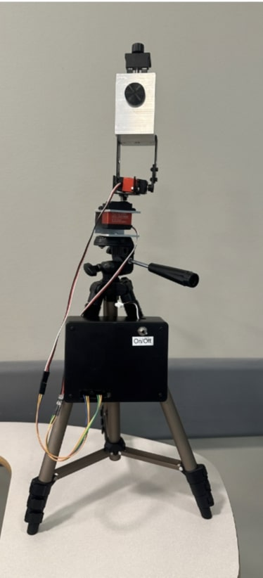
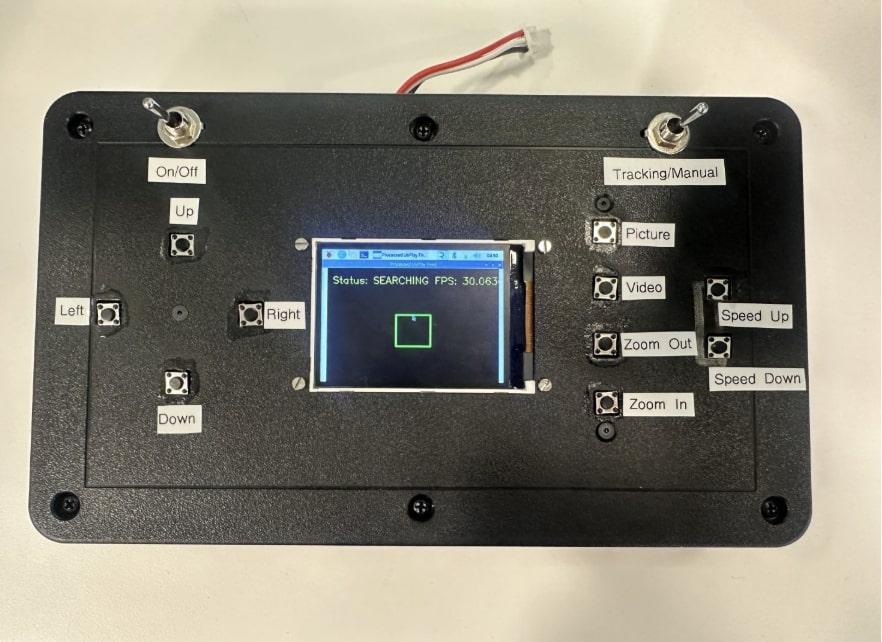

# ECE445 Senior Design
This is the Git Repo and engineering notebook of Kadin Shaheen, a member of Team 29, Smart Tripod

# Smart Tripod

The goal of this project was to develop a smart tripod capable of both manual and automated tracking, featuring motorized movement for zenith and azimuth angles. The tripod features a handheld controller that sports a small LCD screen that shows real-time feedback of the phone's display via AirPlay.

## Final design
Below is an image of the motorized tripod system. The PCB is inside the black box  

  

This next image is a photo of the controller. The PCB for the controller system, designed by Henry Thomas, is inside along with a Raspberry Pi for running OpenCV.

  

