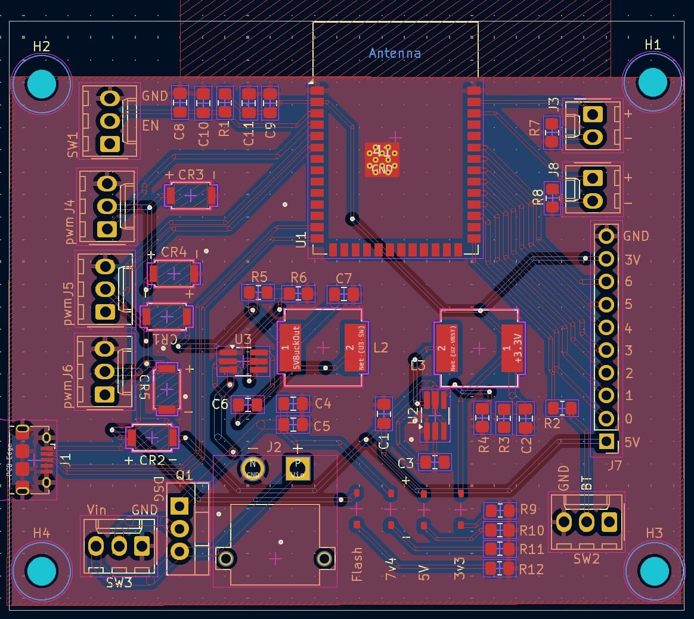

# KiCad files

The above files are set as Handheld, however they are the files for the motorized tripod. Backups are included of the files over minor changes and major changes to the PCB. 

# Original PCB

# Final PCB

