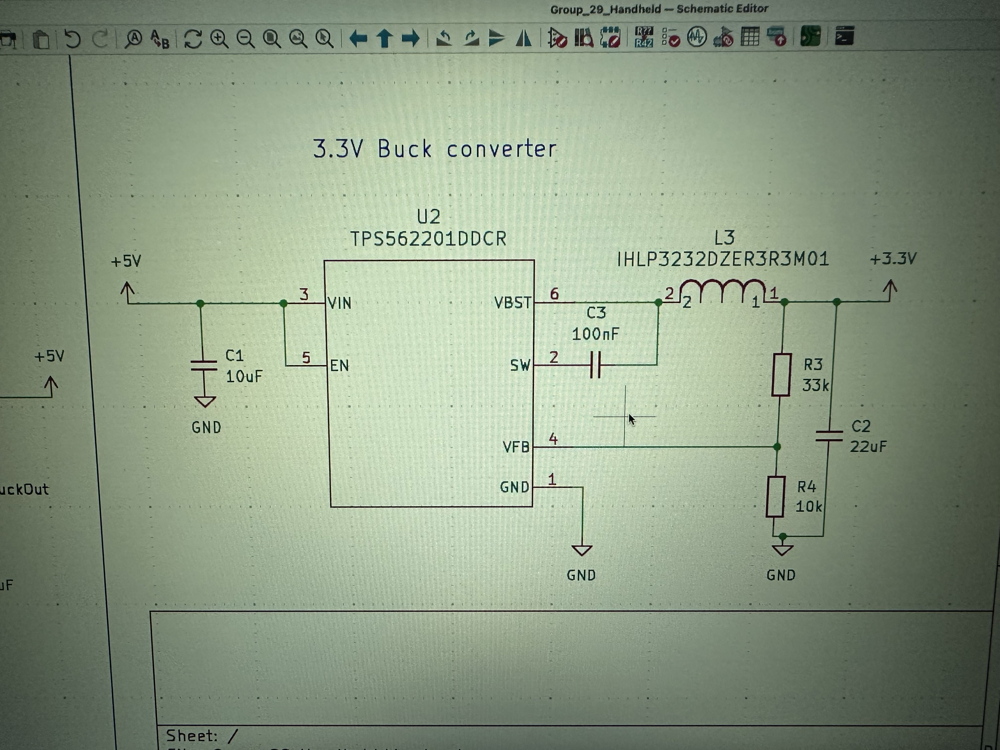
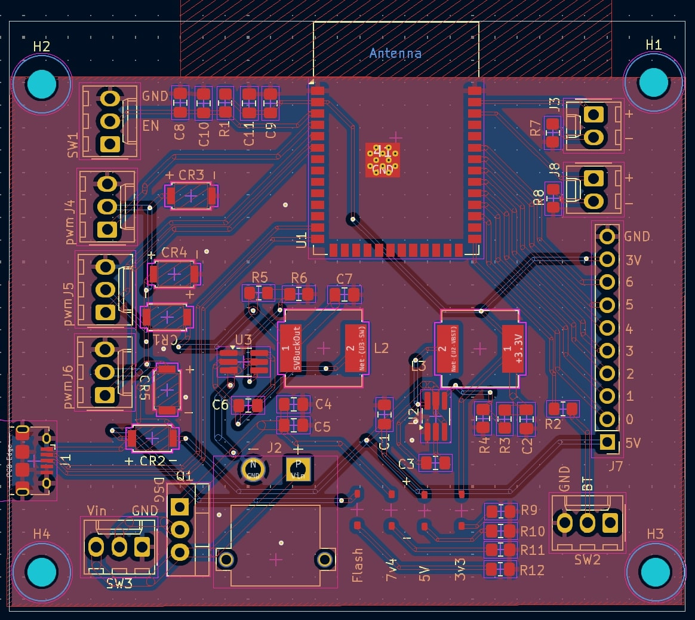
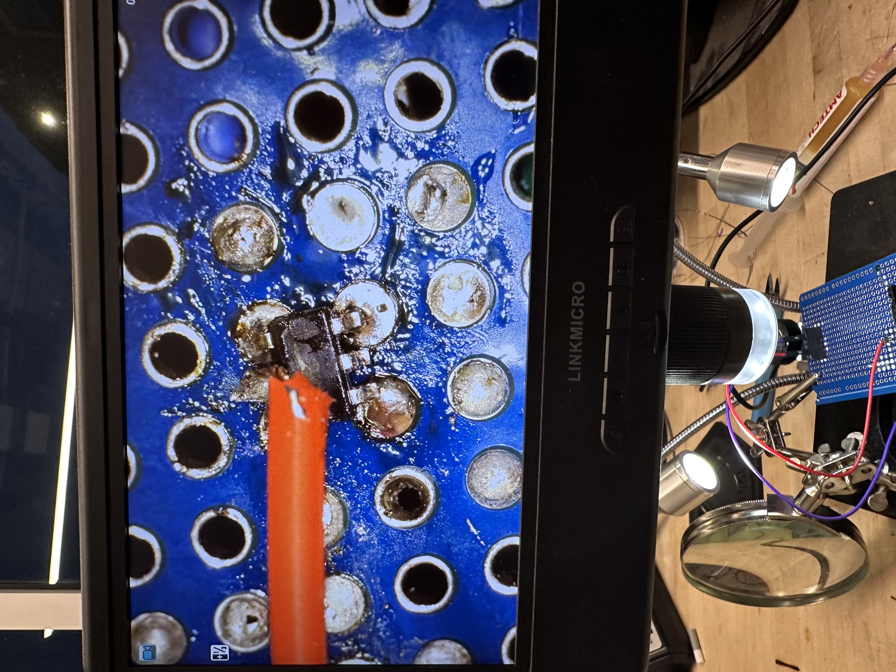
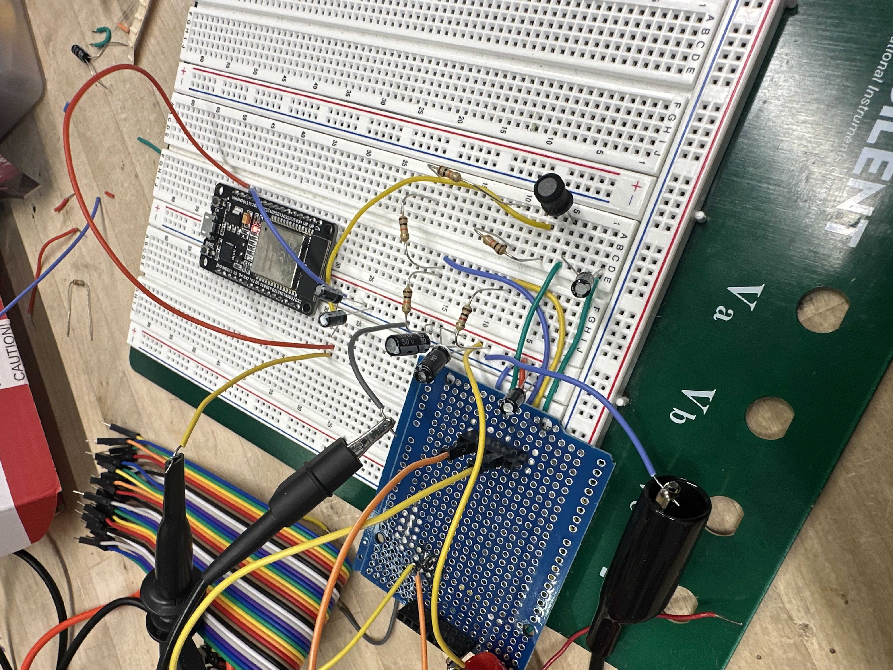
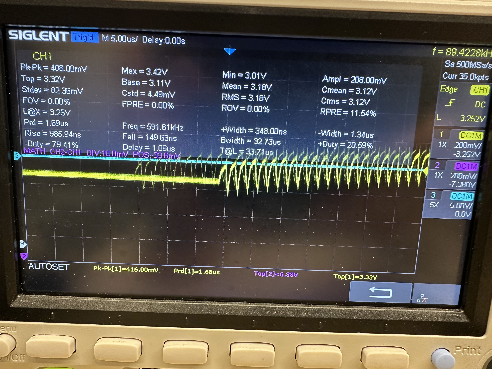
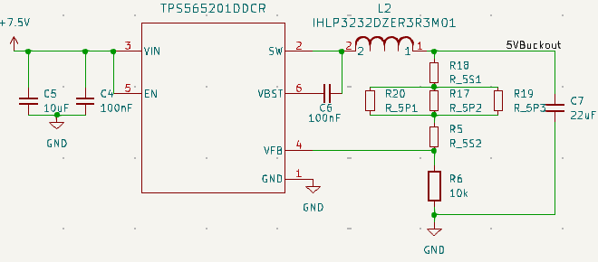

## 2025 - 02 - 11
Worked on the proposal, looking into designing the power systems. So far we're working with two ESP32-S3's for their WiFi availability. As per the [documentation](https://www.espressif.com/sites/default/files/documentation/esp32-s3_datasheet_en.pdf) for the ESP32-S3 it recommends a 1A power source at 3.3V with + or - 100 mV accuracy. The Raspberry Pi recommended [documentation](https://www.raspberrypi.com/documentation/) suggest using a 5.1V power supply with the same + or - 100mV accuracy, and a suggested 3.5A available current supply. This is likely higher than what we will use, as we're only using the the RasPi for computational work with OpenCV as well as for the SPI video display. We're going to estimate a total maximum instantaneous current draw of 3A for the raspberry pi and 1A for the ESP32-S3
## 2025 - 02 - 18
Proposal meeting date, we met with Professor Gruev and he mentioned how we should consider filtering for the servo motors, as well as the high current and power draw. He discussed with us that even with linear regulators and buck converters, it's still possible for the motors to cause brown outs on the battery, which could affect the available power for our other onboard electronics. Still need to look into figuring out a 12V power system for the stepper motors. Currently I'm thinking of these [stepper motors](https://www.adafruit.com/product/324), which should be small and deliver enough power to turn and hold the phone. My current design goal is to discuss, with the machine shop, integrating the PCB and onboard electronics into part of the rotating assembly, so we don't have to worry about adding slip rings or anything.
## 2025 - 02 - 20
We talked with the machine shop, and they recommended switching to servo motors. It would be easier to integrate the design together with the components they have, and reduce out power requirements. They also suggested that while we would lose some of the availability in degrees of freedom, we would gain back in easier control resources and easier angular accuracy. So far we're going to focus on that, as it will be easier to start that, prove it for our breadboard demo and integrate our design in the end.  
  
I started working on fleshing out the power systems a little bit more. The only other issues I'll face is likely going to be with peripheral designs with buttons as well as figuring out how to flash the ESP32 controller via MicroUSB, since MicroUSB is available out of the TA order form. After searching for a while, I'm looking to focus on the [TPS565201DDCR](https://www.ti.com/lit/ds/symlink/tps565201.pdf?HQS=dis-dk-null-digikeymode-dsf-pf-null-wwe&ts=1741532364837) and [TPS562201DDCR](https://www.ti.com/lit/ds/symlink/tps562201.pdf?HQS=dis-dk-null-digikeymode-dsf-pf-null-wwe&ts=1746641732830&ref_url=https%253A%252F%252Fwww.ti.com%252Fgeneral%252Fdocs%252Fsuppproductinfo.tsp%253FdistId%253D10%2526gotoUrl%253Dhttps%253A%252F%252Fwww.ti.com%252Flit%252Fgpn%252Ftps562201) adjustable Buck converter ICs, capable of delivering 5A and 2A respectively. These ICs are fairly cheap at around 35 cents per, so they work very well with our specifications The documentation has recommended design PCB design suggestions, and suggests an overall 60-70mV noise at the switching frequency. I'm looking to get an initial power design finished, so Henry Thomas and I can start working on developing initial PCBs. I also plan to order the two buck ICs for the breadboard demos, as well as look into figuring out how to integrate the servo motors.  
    
We will be moving forward with a 7.4V battery, and step down to 5V and then to 3.3V, this makes it more efficient for our design, and will save us some of the additional challenges of designing a buck-boost converter. In this case the 7.4V battery is cheaper than finding a 3.7V as we want a high current capacity. Estimating worst case efficiencies with the power consumption of the ESP32 and 3A at 5V for both the motors and RasPi. This puts us at (3.3V/7.4V * 3.3V * 1A) + (5V/7.4V * 5V * 3A) = 13.88 W of power required. This would require a 1.875A battery, so our minimum requirements is a 7.4V 2s 2c 1000mAh battery for 30 minutes of battery life or a 7.4V 2s 1c 2000mAh battery for 1 hour of battery life. 

## 2025 - 02 - 25
Started working on both the controller PCB and the motorized tripod PCB. I'm going to be handing over the controller PCB to Henry Thomas, since he's working more with the Rapsberry Pi, and understands the pinouts he will need for the first round order. So far I need to look into how to flash the ESP32-S3. I don't know if we need a UART bridge IC, which may be hard to find in a hand solderable IC platform. The circuit schematic for the . The 3.3uH capacitor was selected from the recommended IC sheets. It would likely cause a longer startup time, from switch to activation, but the higher inductance will help reduce coupled noise at lower load power consumptions. I also went with higher resistor values, 10k and 33k to get close to the 3.3V that we're trying to achieve. It may not be a major issue, and so far I'm only focusing on designing the 3.3V buck circuit, as the 5V circuit is designed in a similar manner, so it will be easy to transfer and switch resistor values. Below is the current 3.3V design.  

## 2025 - 03 - 02
Finished the first round PCB orders. The current PCB design can be seen below. The buck ICs are expected to arrive in a day or two, so I'm going to put my focus into designing the breadboard circuit to test it. Henry and I did end up figuring out how to flash, and it doesn't require, supposedly the ESP32-S3 has a built in SPI flash, so we won't need to have USB to UART bridge or USB to SPI bridge. The differential pair of the MicroUSB can be connected straight to the ESP32-S3.  

Currently, Henry and I are testing different circuit schematics. I'm unsure of if we're going to be able to run power through a switch, as I'm concerned about power loss. I also want to integrate the same 5V plane, so you're able to use the motorized tripod while it's being plugged in, so I've added reverse polarized Schottky diodes at the MicroUSB and 5V buck converter, so we don't get back current through either the IC or the MicroUSB. I've also added additional Schottkys as flybacks for the servo motors, as I'm unsure of if the servos will have built in schottkys. Best case scenario, is we won't need to include the Schottkys.  

## 2025 - 03 - 07
This past week we've been working on the team evaluations and the design document. I've been working on soldering the buck IC as well, a photo of which can be seen below for the breadboard demo. I'm expecting that there will be a lot of various coupling mechanisms so filtering noise out won't be very efficient, or I may find that the breadboard circuit experiences way higher noise than expected. The IC of the TPS562201 can be seen below.

## 2025 - 03 - 09
I finally got the breadboarded circuit working. The buck IC is not solder in the best way, which makes it difficult to ensure that I don't blow the IC, or to ensure that I don't break off the wires coming off the middle pins of the IC. The breaboarded circuit and it's components can be seen below, along with poor image of the output signal. It looks like I'm experiencing 400 mV peak to peak which is way outside of the requirements. It also appears that the buck IC voltage output is not as accurate as specified by the data sheet, so I may need to look into ways to tune the resistance in the final design.  

  

It's good enough for a breadboard demo, as it shows proof of concept, but I'm going to need to work on figuring out ways to filter that noise at the switching frequency. I knew that it would be an issue, but not as apparent as it ended up being. I'm hoping that the PCB attenuates some of the couple noise and any external noise that is present, as the wires are currently acting like antennas coupling to themselves.

## 2025 - 03 - 26
First round PCBs came in, though we didn't do any alterations to the second round PCBs, so we'll have to wait till third round orders to change our designs. We noticed a slight issue with the way I connected the 3.3V buck IC, as the schematic I downloaded for the TPS565201 AND TPS562201 have their VBST and SW pins switched. Henry's design works fairly well, though is MicroUSB port is backwards. With some fanagling, we were able to get the port to stay in place and not be interfered by any of the additional circuitry. The board was flashed to successfully.  
After some more tedious work, I was able to scratch out a trace on the tripod PCB, and solder in a 100nF capacitor over the TPS562201, which proved that our 3.3V buck converter does work. We're seeing around a 180mV peak to peak at a 3.3V average, which is just within our requirements. However, as soon as we are in the presence of the ESP32-S3 network, that jumps up to around 210mV peak to peak, which is just outside our requirement. I wasn't expecting the radiated RF frequency emissions to cause so much noticeable noise, so we'll have to look into more filtering options. I still haven't found a good option, as I can't find any capacitors that specify the their ESL that I could use to set the minimum dB drop at the switching frequency. However, since the WiFi signal causes so much noise, we're looking into adding linear regulators instead.  
Looking forward, I want to work on the third round designs and then finish up with working on some of the motor control. We did find out that there are flyback diodes inside the servos, so I'll end up removing the flybacks I have to conserve some board space.

## 2025 - 03 - 30
I've been focusing on the third round designs and working with the tripod PCB power system, as I've gotten that one to work properly. I've been testing the output of the 5V and the 3.3V, and I noticed that with my current design layout, I'm seeing the buck converter's noise couple into each other, instead of getting filtered out through the 3.3V converter. This design layout had used the 3.3V converter on the output of the 5V converter, so we're going to switch to the buck converter's in parallel, both having the 7.4V input. This should ensure that the rouhgly 800 mV of noise we're noticing on the 3.3V buck converter doesn't harm our internal ESP32-S3.

This time I added 100nF filter capacitors at the servo motor outputs with larger 8x12 electrolytic capacitor positions, for adding capacitors later, if we should need more filtering on our voltage lines near the servo motors. I also added a small resistor network into the buck converter outputs, to allow us to tune them. a total of 3 in paralle with two more in series of that, shown in the image below.  

  
  
We've also decided to add two linear regulators. the [AZ1117-3.3](https://mm.digikey.com/Volume0/opasdata/d220001/medias/docus/835/AZ1117_Rev5.3_Jan2019_DS.pdf)
and the [MIC29300-5.0WU-TR](https://ww1.microchip.com/downloads/en/DeviceDoc/MIC2915x-30x-50x-75x-High-Current-Low-Dropout-Regulators-DS20005685B.pdf). These are a 3.3V 1A LDO and a 5V 3A LDO respectively. These will be going on the outputs of our buck converters to help regulate the voltage. We did test the buck converter with the AZ1117-3.3 today, and we found it to have roughly a 40mV peak to peak noise, which is well within our margins, so moving forward with an LDO is the easiest option. 

